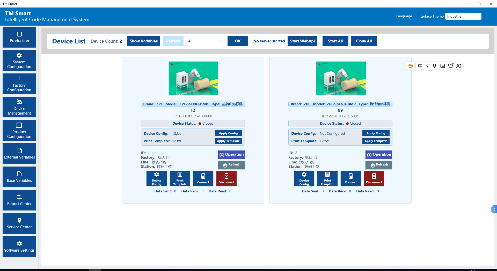
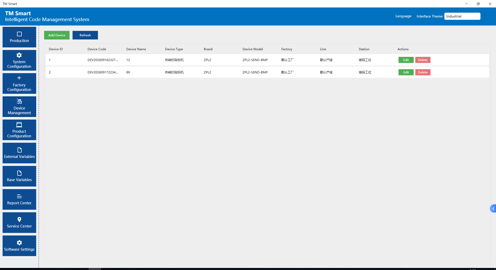
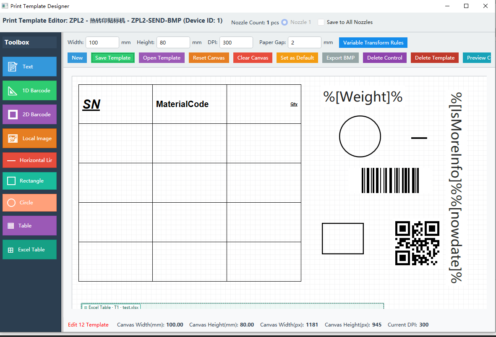
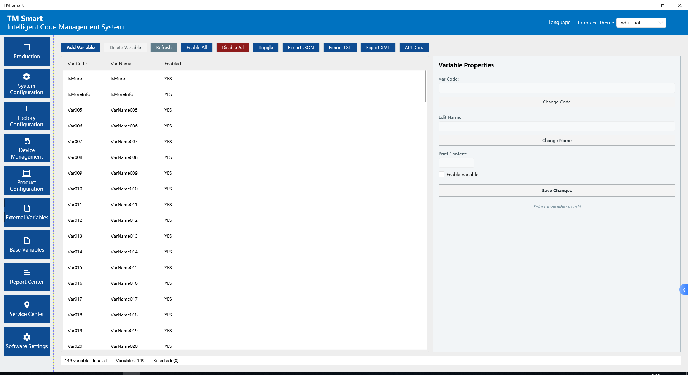
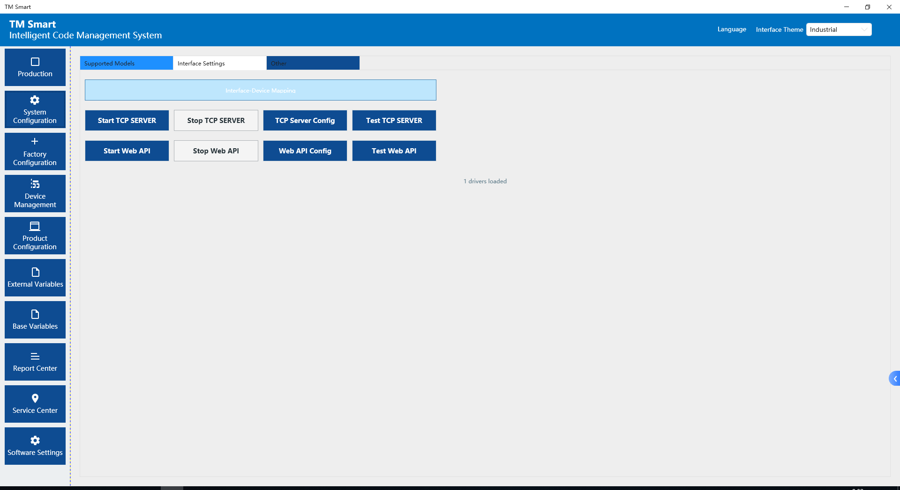
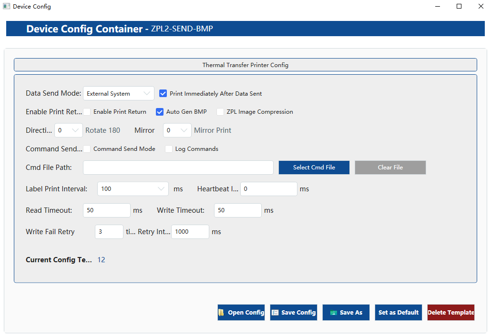

# Industrial Label Printing Suite

A production-grade Windows desktop application for **centralized management and remote printing across multiple industrial label printers** — built for factory floors where label data arrives from MES, ERP, or external systems, and every print job must land correctly on the right device.



---

## What It Solves

On a real production line, labeling is rarely a single-printer problem. A typical line runs several thermal-transfer labelers at different stations, each running a different template, each receiving data from a different upstream system — and all of them expected to work without an operator babysitting them.

This application handles that whole chain: **data in → variable mapping → template rendering → command generation → multi-device dispatch → result tracking.**

---

## Capabilities

### Multi-Device Management
Register and manage multiple printers from one console. Each device is defined by brand, model, type, and physical location (factory / line / station), with independent connections, per-device configuration, and live status monitoring.



- Connection lifecycle control per device — connect, disconnect, refresh
- Separately tracked hardware counters: **Data Sent / Data Recv / Data Read**
- Per-device, per-config, per-template assignment (a device can switch templates at runtime without restarting)

### Visual Template Designer
A dedicated WYSIWYG editor for label layout — no hand-written printer commands required.



- **Text, 1D barcode, 2D barcode (QR), local images, lines, rectangles, circles, tables, and Excel-bound tables**
- Physical-unit canvas with mm dimensions, configurable DPI, paper gap
- Device-specific output renderers — the same design targets **ZPL** and **TSPL** printers
- Export / import templates as BMP or editable project files
- Runtime-adjustable variable transform rules

### Variable Pass-Through
Print data is decoupled from print templates. Variables flow in from external systems and are mapped onto template placeholders at print time.



- External and base variable sets, each independently enabled/disabled
- Template syntax: `%[Weight]%`, `%[nowdate]%` — external values bound directly into the layout
- Import/export variable definitions as **JSON / TXT / XML**
- Bulk operations and toggle-all for large variable libraries

### Interface & Integration
Structured interfaces for upstream systems, not a black box.



- **TCP Server** — external systems push label data in; config mode, test mode, and remote configuration
- **Web API** — HTTP-based integration for systems that prefer request/response over sockets
- Multi-driver architecture — each printer family is handled by its own driver
- **Easily extensible** — adding a new printer brand or model means implementing one driver
- Built-in interface documentation for integrators

### Device-Level Print Control
Every printing behavior is configurable per device — because no two production lines behave the same.



- Data send mode: internal / external system
- **Print Immediately After Data Sent** (with the alternative buffered mode)
- Auto BMP generation, optional ZPL image compression
- Rotation and mirror printing
- Read/write timeouts, heartbeat interval, and **write-fail retry with configurable retry count and interval**
- Command mode with command-file logging for troubleshooting

---

## Architecture

```
┌──────────────────┐
│   MES / ERP /    │
│  External System │
└────────┬─────────┘
         │ TCP / Web API
         ▼
┌────────────────────────────────────────────────┐
│            Printing Core Service               │
│  ┌──────────────┐   ┌────────────────────┐    │
│  │ Variable     │   │ Template Engine    │    │
│  │ Mapping      │──▶│ (ZPL / TSPL render)│    │
│  └──────────────┘   └─────────┬──────────┘    │
│                                │               │
│  ┌─────────────────────────────▼────────────┐ │
│  │       Device Dispatch Manager            │ │
│  │  connection pool · retry · status track  │ │
│  └──┬──────────────┬──────────────┬─────────┘ │
└─────┼──────────────┼──────────────┼───────────┘
      ▼              ▼              ▼
 ┌─────────┐   ┌─────────┐   ┌─────────┐
 │ Printer │   │ Printer │   │ Printer │
 │ (ZPL)   │   │ (TSPL)  │   │ (TSPL)  │
 └─────────┘   └─────────┘   └─────────┘
```

---

## Tech Stack

| Layer | Technology |
|---|---|
| Application | C# / .NET Desktop (Windows) |
| Template Rendering | Command generation for ZPL & TSPL printers |
| Integration | TCP Socket Server, HTTP Web API |
| Variable I/O | JSON, XML, TXT |

---

## Design Principles

**Factory software cannot fail silently.** The system tracks per-device send/receive/read counters, logs command traffic, retries failed writes with bounded attempts, and surfaces connection state continuously — so an operator knows a printer is down before the line stops.

**Drivers are pluggable, not hard-coded.** Adding a printer brand means adding a driver, not touching the core. This is what allows one installation to serve a mixed fleet.

**Data and layout stay separate.** Upstream systems send values; templates own the presentation. A layout change never requires an upstream code change.

**Physical units, not pixels.** Templates are authored in millimeters with explicit DPI, so what the designer shows is what the printer produces.

---

## Use Cases

- Production line labeling driven by MES/ERP data
- Multi-station labeling with centralized template management
- Barcode/QR code printing for product traceability
- Retrofit labeling control for mixed-brand printer fleets

---

## Repository Contents

| File | Description |
|---|---|
| `main.png` | Multi-device dashboard with live status and counters |
| `equipments.png` | Device registry with location and type metadata |
| `printerTemplate.png` | Visual label template designer |
| `var.png` | Variable management and import/export |
| `interface.png` | TCP / Web API interface control |
| `DeviceConfig.png` | Per-device printing behavior configuration |

---

## Status

This repository documents the architecture and user-facing capabilities of the system through annotated interface views. Source code is not published here.

---

## Author

Industrial software engineer with long-term experience developing and commissioning production-line systems — device integration, data collection, product traceability, and shop-floor print infrastructure.

Available for custom industrial software development: device drivers, equipment integration, production data collection, and traceability systems.

---

## License

See [LICENSE](LICENSE).
